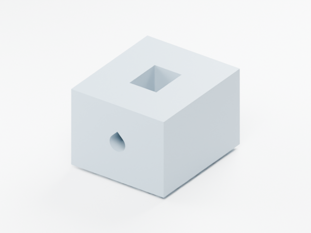

# CadQuery + Blender 机械建模技能

把尺寸图或实测数据转成可 3D 打印的机械零件，保留参数化源代码，输出 SolidWorks 可导入的 STEP、打印 STL 和 Blender 预览。

本技能从一次屏幕保护壳和吊装支架的实际建模过程整理而来。实际建模工具是 **CadQuery + Blender**；SolidWorks 是 STEP 兼容目标。流程涵盖尺寸来源、角度方向、五金空间、打印朝向、导出文件复核和版本交付。后续长通道打印失败的经验也已纳入：几何贯通检查不能替代打印和清理检查。

## 安装

将 `skills/cadquery-blender-modeling` 整个文件夹复制到你的 Codex 技能目录，通常为 `~/.codex/skills/`（Windows 为 `%USERPROFILE%\.codex\skills\`）。重新打开会话后确认它出现在可用技能列表中；文件已复制不代表当前聊天已刷新加载。

调用示例：

> 使用 $cadquery-blender-modeling，按尺寸图设计一个屏幕背壳和吊装支架。屏幕下沿靠近操作者，导出 STL、STEP 和 Blender 预览，并核对螺母安装路径及打印朝向。

技能可自动选择；脚本依赖单独安装。Python 检查与示例使用 `cadquery`、`trimesh`、`numpy`；渲染脚本通过 Blender 自带 Python 执行，使用当前 STL 导入操作。SolidWorks 只在需要打开 STEP 或制作原生文件时需要。

辅助脚本依赖可在自己的 Python 环境用 `python -m pip install -r requirements.txt` 安装。Codex 使用技能需要能执行 Python 脚本和启动本地 Blender；只有聊天文本、没有本地工具的环境不能直接生成这些工程文件。

## 包含内容

| 文件 | 用途 |
|---|---|
| `SKILL.md` | 建模、验证和交付决策 |
| `references/` | 格式兼容、打印判断、脚本输入说明 |
| `scripts/build_fit_coupon.py` | 通用短孔、开放螺母槽试块示例 |
| `scripts/audit_models.py` | 检查最终 STEP/STL 和指定直孔 |
| `scripts/render_models.py` | 创建 Blender 场景及正、背、侧视图 |
| `scripts/package_delivery.py` | 显式清单打包与 SHA-256 核对 |

可运行示例及详细参数见 [automation.md](skills/cadquery-blender-modeling/references/automation.md)。本仓库不包含原项目模型、厂商尺寸图或软件安装包。示例是通用工艺试块，不是已验证承重零件。STEP 保留实体几何，不等于 SolidWorks 原生特征树。

## 验证

已在 Python 3.13.5、CadQuery 2.8.0、Trimesh 5.0.0 和 Blender 5.2.1 LTS 环境完成试块生成、STEP/STL 重新导入复核、三视图渲染、毫米/米转换核对及压缩包 SHA-256 核对。七项行为测试覆盖有效导出、开口网格拒绝、错误孔位拒绝、打印件离床拒绝、凸柱误报孔的防护、丢失/越界文件拒绝和参数变化。没有实际打印、切片或承重测试。

维护者可运行 `python -m unittest discover -s tests -v`；Blender 的验证命令见上面的脚本说明。技能格式校验通过并不证明任何新模型符合制造要求。

许可证：[MIT](LICENSE)。
